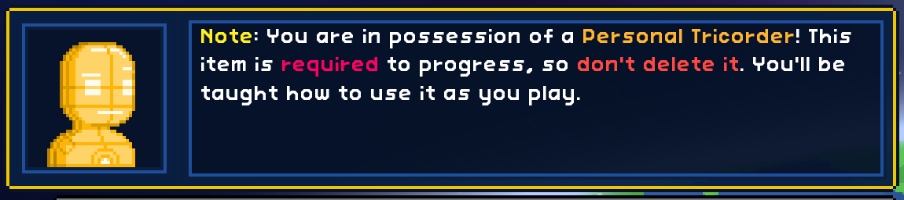

# Frackin' Universe Intro De-Overwhelmer

This is a tiny mod that edits the intro to Frackin' Universe to dramatically shorten it, vitally **without removing information necessary for new players.**

A good tutorial shows and tells. FU's current intro tells, says to wait, then shows and tells later.

For what it's worth, I think the long intro is just kind of an old holdover, or maybe an accidental thing in the grand scope of the entire mod, because FU already tells you how to use all of the features it talks about in a much better way: By telling you when you get to that point.

So:

### 1. Restarting your ship now shows a single message which lingers for 20 seconds (compare to FU's six messages over the course of 2m10s).

### 2. The information that was trimmed out of the intro has been edited into Vinalisj's intro dialogue:

This one is kind of an extra because the #1 thing I hear when I get somebody into Starbound with FU is "Hey so I researched the furnace but I can't find it in my crafting menu". So I've taken the liberty of editing Vinalisj's dialogue to be a hands-on tutorial now covering *where* to research (since I removed that from the Tricorder message) and also where to make crafting stations.

All other messages are untouched.